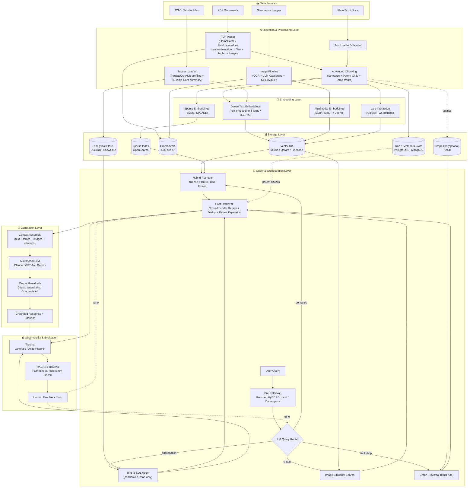

# Advanced Multimodal RAG Architecture — Production Design Document

**Author role:** Principal AI/ML Solutions Architect
**Scope:** Enterprise-grade Retrieval-Augmented Generation system ingesting unstructured text, complex PDFs (text + tables + images), standalone images, and structured CSV/tabular data.

---

## 0. Executive Summary & Data Flow Sequence

A naive "chunk → embed → retrieve → generate" RAG pipeline breaks down in enterprise settings because real data is **heterogeneous**: PDFs mix prose, tables, and charts; CSVs need exact aggregation, not fuzzy vector search; images need visual grounding, not just captions. This design uses a **multi-modal, multi-index, agentic-routing architecture** — one retrieval path per data modality, unified at query time by an LLM-based router, and merged by a re-ranking + synthesis layer before generation.

### End-to-End Data Flow (Ingestion → Response)

1. **Ingestion trigger** — file lands in object storage (S3/Azure Blob) via upload API, connector (SharePoint/Confluence/Google Drive), or batch ETL.
2. **Type detection & routing** — a classifier/router (file extension + MIME + light content sniffing) sends the file to the correct parser: PDF parser, CSV/tabular loader, or image pipeline.
3. **Parsing & extraction**:
   - PDFs → layout-aware parsing (text blocks, tables as structured HTML/Markdown, images extracted with bounding boxes) via LlamaParse / Unstructured.io.
   - CSVs → schema inference, profiling, and loading into an analytical store (DuckDB/PostgreSQL) *plus* a natural-language table summary.
   - Images → OCR (if text-bearing), layout detection, and dual encoding (caption text + CLIP/SigLIP visual embedding).
4. **Chunking** — semantic + parent-child recursive chunking applied to text/table content; images kept as atomic units linked to their parent document.
5. **Embedding** — dense embeddings (text-embedding-3-large / Voyage / BGE) for text chunks; multimodal embeddings (CLIP/SigLIP) for images; optional late-interaction embeddings (ColBERTv2) for high-precision text retrieval.
6. **Indexing/Storage** — vectors → Vector DB; raw text/JSON/images → Document store + Object store; table schemas → relational catalog; entity relations (optional) → Graph DB; keyword index → BM25/OpenSearch.
7. **User query arrives** at the Query/Orchestration layer (e.g., LangGraph/LlamaIndex agent).
8. **Pre-retrieval** — query classification, rewriting, decomposition, and expansion (HyDE, multi-query).
9. **Routing** — LLM router decides: semantic vector search, SQL/Text-to-SQL agent, image similarity search, or a hybrid combination of these.
10. **Retrieval** — hybrid dense+sparse search per selected index(es); parent document expansion; SQL agent executes generated queries against the tabular store; image search returns nearest visual neighbors.
11. **Post-retrieval** — deduplication, cross-encoder re-ranking, contextual compression, and (optionally) graph-based relationship expansion.
12. **Context assembly** — merged, ranked context (text + tables + image references) packed into the multimodal LLM prompt with citations/provenance metadata.
13. **Generation** — multimodal LLM (e.g., Claude, GPT-4o/GPT-5, Gemini 2.x) generates a grounded answer, optionally rendering retrieved images inline.
14. **Guardrails** — output-side guardrails check for hallucination, PII leakage, toxicity, and policy compliance before the response is returned.
15. **Response delivered to user**, with citations (source doc, page, table, image).
16. **Observability loop** — every step logs traces (Langfuse/Arize Phoenix); RAGAS/TruLens continuously score faithfulness, relevancy, and groundedness; user feedback (👍/👎) closes the loop for retraining/re-ranker tuning.

---

## 1. Data Ingestion & Processing Pipeline

### 1.1 Complex PDF Parsing (Text + Tables + Images)

Standard `PyPDF2`/`pdfplumber` text extraction fails on multi-column layouts, nested tables, and embedded charts. Use **layout-aware, model-based parsers**:

| Tool | Strength | Use When |
|---|---|---|
| **LlamaParse** (LlamaIndex) | LLM-native parsing, outputs clean Markdown with tables preserved as Markdown tables, handles multi-column layouts, JSON mode for structured extraction | Default choice for financial reports, contracts, scientific papers |
| **Unstructured.io** (open-source `unstructured` + hi_res strategy) | Detectron2/YOLOX-based layout detection, partitions into `Title`, `NarrativeText`, `Table`, `Image`, `Header/Footer` elements with metadata | Self-hosted/air-gapped environments, fine-grained element control |
| **Azure Document Intelligence / AWS Textract** | Managed OCR + table/form extraction with high accuracy on scanned docs | Regulated industries needing SLA-backed managed services |
| **Docling (IBM)** | Open-source, strong table structure recognition (TableFormer), DocTags output | Cost-sensitive self-hosted table-heavy corpora |

**Pipeline for a PDF page:**
1. Render page → layout model (Detectron2/YOLO/DiT) detects regions: text blocks, tables, figures.
2. Text regions → OCR (if scanned) or native text extraction, reading-order reconstructed.
3. Table regions → table-structure recognition (TableFormer/Table Transformer) → exported as **Markdown or HTML table** (preserves row/col semantics far better than flattened text).
4. Figure/chart/image regions → cropped and saved to object storage; passed to the **multimodal image pipeline** (§1.3) for captioning/embedding.
5. All extracted elements retain **provenance metadata**: `{doc_id, page_number, bbox, element_type}` — critical for citation and re-ranking later.

### 1.2 Structured CSV / Tabular Data Strategy

Two complementary strategies — **do not choose only one**:

**A. Pandas-to-Text-Summary (for semantic/RAG retrieval)**
- Load CSV → Pandas/Polars DataFrame → generate profiling summary (column names, dtypes, min/max, cardinality, sample rows, business description if available via data catalog).
- LLM-generate a natural-language "table card" (what the table represents, key columns, granularity) — this summary gets embedded and stored in the vector index so semantic queries like *"which dataset has customer churn info?"* can find the right table.
- Use for **discovery** queries and small reference tables that can be flattened into narrative chunks (row-as-sentence templating) when the table is small (<200 rows) and queries are lookup-style.

**B. Text-to-SQL Routing (for analytical/aggregation queries)**
- Load CSV into a proper analytical engine: **DuckDB** (embedded, zero-ops, excellent for local/medium data) or **PostgreSQL** (multi-user, transactional, easy to scale) or **Snowflake/BigQuery** for enterprise scale.
- Maintain a **schema catalog** (table/column descriptions, relationships) — this is what the Text-to-SQL agent conditions on.
- At query time, an LLM-based SQL agent (LangChain `SQLDatabaseChain`, LlamaIndex `NLSQLTableQueryEngine`, or Vanna.ai) generates SQL, executes it in a **sandboxed read-only** connection, and returns a DataFrame that the LLM verbalizes.
- **Guardrail:** restrict the SQL agent to `SELECT`-only, use a read replica, add row-level limits, and validate generated SQL with a linter/AST check before execution to prevent injection or destructive queries.

**Decision rule:** *"What data exists?" → semantic search over table summaries. "Compute/aggregate/filter numbers" → Text-to-SQL.* The Query Router (§3.1) makes this decision automatically.

### 1.3 Multimodal Ingestion for Standalone Images

For images uploaded directly or extracted from PDFs:
1. **Layout/content classification** — is it a chart, diagram, photo, screenshot, or scanned text page?
2. **OCR pass** (Tesseract / PaddleOCR / cloud OCR) for any embedded text (chart labels, screenshots).
3. **Captioning/description** — a vision-language model (GPT-4o-vision, Claude with vision, Gemini, or open-source BLIP-2/LLaVA/Qwen2-VL) generates a rich textual description, especially for charts ("bar chart showing Q1–Q4 revenue growth from $2M to $5M") — this text gets embedded into the same vector space as text chunks for **cross-modal retrieval via text query**.
4. **Multimodal embedding** — separately, encode the raw image with **CLIP** or **SigLIP** into a shared image-text embedding space, enabling **image-to-image** and **text-to-image** similarity search without relying solely on the caption.
5. Store both: `{image_embedding (CLIP), caption_embedding (text-embed), caption_text, image_uri, source_doc_ref}`.

### 1.4 Advanced Chunking Strategies

| Strategy | Description | Best For |
|---|---|---|
| **Semantic Chunking** | Split text at points of embedding-distance discontinuity (sliding window, compute adjacent-sentence similarity, break where similarity drops) rather than fixed token counts | Narrative text, policies, long-form reports where topic shifts matter |
| **Parent-Child Recursive Chunking** | Small "child" chunks (256–512 tokens) are embedded and indexed for precise retrieval; each child stores a pointer to a larger "parent" chunk (e.g., full section/page, 1500–3000 tokens) which is what actually gets sent to the LLM for context | Almost always — improves retrieval precision *and* generation context sufficiency |
| **Table-Aware Chunking** | Never split a table mid-row; keep table + its caption/preceding paragraph together as one chunk; large tables get row-group chunking with header repeated in every chunk | Financial statements, spec sheets |
| **Structural/Markdown-Header Chunking** | Split on heading hierarchy (H1/H2/H3) from parsed Markdown, preserving section context in metadata | Technical docs, manuals |
| **Sliding Window w/ Overlap** | Fallback fixed-size (e.g., 512 tokens, 15–20% overlap) | Homogeneous plain text, fallback when structure is unclear |

**Recommended default:** Structural chunking (respecting headings/tables) → semantic chunking within long sections → parent-child linkage for all chunks.

---

## 2. Embedding & Storage Strategy

### 2.1 Embedding Model Selection

| Modality/Use case | Recommended Model | Alternatives | Notes |
|---|---|---|---|
| General dense text embedding | **OpenAI `text-embedding-3-large`** | Voyage AI `voyage-3-large`, Cohere `embed-v4`, open-source `BGE-M3`, `gte-large-en-v1.5` | BGE-M3 is a strong self-hosted choice — supports dense + sparse + multi-vector in one model |
| High-precision late-interaction retrieval | **ColBERTv2 (via RAGatouille)** | ColPali (for visually-rich docs) | Token-level matching beats single-vector for legal/technical precision; higher storage cost |
| Multimodal (image+text) | **CLIP (OpenAI ViT-L/14)** or **SigLIP** | Google `Gemini embedding`, Cohere `embed-v4` (multimodal), **ColPali** (embeds page *images* directly, skipping OCR) | ColPali is state-of-the-art for visually-rich PDFs (charts/infographics) since it embeds the rendered page, not extracted text |
| Sparse/keyword | **BM25 (Lucene/OpenSearch built-in)** or **SPLADE** | — | Combine with dense for hybrid search |

**Key architectural point:** don't force one embedding model to do everything. Use a **dense text model** for prose, **ColPali/CLIP** for visual content, and **BM25/SPLADE** for exact keyword/entity matching — then fuse at retrieval time.

### 2.2 Storage Layer Architecture

| Store | Purpose | Recommended (Managed) | Recommended (Open-Source/Self-Hosted) |
|---|---|---|---|
| **Vector Database** | Store embeddings + ANN search | Pinecone, Zilliz Cloud, Weaviate Cloud, Azure AI Search | **Milvus**, **Qdrant**, **Weaviate**, `pgvector` (on Postgres) |
| **Document/Metadata Store** | Raw text, chunk metadata, provenance, parent-child pointers | MongoDB Atlas, Amazon DocumentDB | **PostgreSQL** (JSONB), **MongoDB** |
| **Object Storage** | Raw PDFs, extracted images | Amazon S3, Azure Blob | MinIO |
| **Relational/Analytical Store** | CSV/tabular data for Text-to-SQL | Snowflake, BigQuery, Amazon Redshift | **DuckDB**, PostgreSQL |
| **Keyword/Sparse Index** | BM25 hybrid search | Azure AI Search, Elastic Cloud | **OpenSearch**, Elasticsearch, Typesense |
| **Graph Database (optional)** | Entity relationships, multi-hop reasoning (GraphRAG) | Neo4j Aura | **Neo4j**, Memgraph |
| **Cache** | Query/embedding cache to cut latency & cost | — | **Redis** |

**Why a Graph DB matters:** for queries requiring multi-hop reasoning ("which vendors supply components used in products that failed QA in Q2?") pure vector similarity fails — a knowledge graph built via entity/relationship extraction (LLM-based triple extraction, e.g., using `LlamaIndex KnowledgeGraphIndex` or `Neo4j GraphRAG` package) enables structured traversal combined with vector retrieval (**hybrid GraphRAG**).

---

## 3. Advanced Retrieval & Query Engine

### 3.1 Query Routing

An **LLM-based semantic router** (single fast-model call, e.g., a small/cheap model like GPT-4o-mini or Claude Haiku) classifies the incoming query into one or more of:
- `VECTOR_SEARCH` — open-ended, conceptual, "explain/summarize/find information about…"
- `SQL_AGENT` — "how many / total / average / list all where…" (aggregation, filtering, numeric)
- `IMAGE_SEARCH` — "show me the chart/diagram/photo of…" or an uploaded image as query
- `GRAPH_QUERY` — multi-hop relationship questions
- `HYBRID` — combination (e.g., "compare Q3 revenue [SQL] with the trend described in the earnings call [vector]")

Implementation options: LlamaIndex `RouterQueryEngine`, LangChain `RunnableBranch`, or a custom classifier fine-tuned on historical query logs. Route confidence below a threshold → fan out to multiple retrievers and merge (safer default for production).

### 3.2 Hybrid Search (Dense + Sparse)

- Run **dense vector search** (cosine/dot-product ANN, e.g., HNSW index) and **BM25/sparse search** in parallel against the same or aligned indexes.
- Fuse results using **Reciprocal Rank Fusion (RRF)** or a weighted linear combination — RRF is preferred as it requires no score normalization tuning.
- Most modern vector DBs (Weaviate, Qdrant, Azure AI Search, OpenSearch) support **native hybrid search** with built-in fusion, reducing custom orchestration code.

### 3.3 Pre-Retrieval Techniques

- **Query Rewriting** — LLM rewrites conversational/ambiguous queries into a standalone, retrieval-optimized query (resolves coreference, e.g., "what about last year?" → "What was total revenue in FY2024?").
- **Query Expansion / HyDE (Hypothetical Document Embeddings)** — generate a hypothetical answer to the query, embed *that*, and search with it — often outperforms embedding the raw question, especially for short/ambiguous queries.
- **Multi-Query Generation** — LLM generates 3–5 paraphrased variants of the query, retrieve for each, union the results — improves recall.
- **Query Decomposition** — break complex multi-part questions into sub-questions, retrieve/answer each, then synthesize (sub-question query engine pattern).

### 3.4 Post-Retrieval Techniques

- **Deduplication & Diversity (MMR)** — Maximal Marginal Relevance to avoid returning 5 near-identical chunks.
- **Cross-Encoder Re-ranking** — after initial top-K (e.g., K=50) retrieval from the fast bi-encoder/BM25 stage, a **cross-encoder** re-ranker scores each (query, chunk) pair jointly for much higher precision, then truncate to top-N (e.g., N=5–8) sent to the LLM.
  - Models: **Cohere Rerank v3**, **BGE-reranker-v2-m3** (open-source), **Jina Reranker**, **ColBERT-based re-ranking**.
- **Contextual Compression** — trim retrieved chunks to only the sentences relevant to the query (LLM-based or embedding-based extraction) to reduce prompt bloat and cost.
- **Parent Document Retrieval** — swap in the full parent chunk/section (from §1.4) once the precise child chunk is identified, so the LLM gets sufficient surrounding context.
- **Graph Expansion (optional)** — for entities found in top chunks, pull 1-hop neighbors from the graph DB to enrich context.

---

## 4. Generation & Observability

### 4.1 Multimodal LLM Selection

| Model | Strength | Notes |
|---|---|---|
| **Claude (Sonnet/Opus, vision-enabled)** | Strong grounded reasoning, long context, good at citing sources, careful with hallucination | Good default for enterprise document QA |
| **GPT-4o / GPT-5-class models** | Strong multimodal (native image+text), fast, broad tool-use ecosystem | Good for chart/image-heavy grounding |
| **Gemini 2.x (Pro/Flash)** | Very long context window (1M+ tokens), native multimodal, strong for video/large-doc corpora | Good when context windows need to be huge |
| **Open-source: Qwen2-VL / LLaVA-NeXT / Pixtral** | Self-hostable, good vision-language grounding | For air-gapped/regulated environments |

The generation prompt should include: the user query, ranked text/table context (with citation IDs), image references (either as actual image inputs to a vision-capable model, or as rich captions if using a text-only model), and explicit **grounding instructions** ("only answer from provided context; cite source IDs; say 'I don't know' if context is insufficient").

### 4.2 Observability & Evaluation

| Concern | Tooling | What it Measures |
|---|---|---|
| **Tracing** (every span: parse→embed→retrieve→rerank→generate) | **Langfuse** (open-source), **Arize Phoenix** (open-source), LangSmith, W&B Weave | Latency per stage, token cost, retrieved chunks per query, full request replay |
| **RAG-specific Evaluation** | **RAGAS** — Faithfulness, Answer Relevancy, Context Precision, Context Recall, Answer Correctness | Automated, LLM-judged scoring on eval sets; run in CI on every pipeline change |
| **Evaluation/Monitoring platform** | **TruLens** | Real-time "feedback functions" (groundedness, QA relevance, context relevance) with dashboards, good for online monitoring in addition to offline eval |
| **Human-in-the-loop** | Feedback capture (👍/👎, corrections) fed into a labeled dataset for re-ranker fine-tuning and eval-set growth | Closes the loop; catch drift |
| **Load/Regression testing** | Golden Q&A dataset run on every deploy, compared against baseline scores | Prevent silent quality regressions |

### 4.3 Guardrails (Production Security)

- **Input guardrails:** prompt-injection detection, PII/PHI redaction before logging, jailbreak detection, topic/scope restriction.
- **Output guardrails:** hallucination/faithfulness check (compare answer against retrieved context, e.g., via RAGAS faithfulness or a lightweight NLI model), toxicity/bias filter, PII leakage prevention, citation enforcement (reject ungrounded claims).
- **Tooling:** **NVIDIA NeMo Guardrails** (programmable rails, Colang DSL), **Guardrails AI** (schema/validator-based), **Llama Guard** (open-source safety classifier), **Presidio** (Microsoft, PII detection/redaction).
- **SQL agent-specific guardrails:** read-only DB role, query allow-list/AST validation, row limits, query timeout, audit logging of every generated SQL statement.
- **Access control:** row/document-level permissions enforced at the vector DB/metadata-store layer (metadata filtering by `user_group`/`acl_tags`) so retrieval never surfaces documents the requesting user isn't authorized to see — critical in multi-tenant enterprise deployments.

---

## 5. Architecture Diagram (Mermaid)

---

## 6. Recommended Technology Stack

| Layer | Open-Source / Self-Hosted | Managed / Commercial | Key Consideration |
|---|---|---|---|
| Orchestration Framework | **LlamaIndex**, **LangChain/LangGraph**, Haystack | LlamaCloud, Azure AI Foundry | LlamaIndex has stronger native RAG abstractions; LangGraph better for complex agentic control flow |
| PDF Parsing | **Unstructured.io** (self-hosted), **Docling** | **LlamaParse**, Azure Document Intelligence, AWS Textract | Managed parsers cost per page but save significant eng time on messy layouts |
| Tabular Engine | **DuckDB**, PostgreSQL | Snowflake, BigQuery, Redshift | DuckDB is excellent zero-ops choice for <100GB workloads |
| Text-to-SQL | Vanna.ai (OSS), LlamaIndex `NLSQLTableQueryEngine` | Snowflake Cortex Analyst, Databricks Genie | Always sandbox + validate generated SQL |
| Vision-Language Model | **Qwen2-VL**, **LLaVA-NeXT** | GPT-4o, Claude (vision), Gemini | Open-source viable for captioning at scale to control cost |
| Text Embeddings | **BGE-M3**, `gte-large-en-v1.5` | OpenAI `text-embedding-3-large`, Voyage AI, Cohere Embed v4 | BGE-M3 uniquely supports dense+sparse+multi-vector in one pass |
| Multimodal Embeddings | **CLIP**, **SigLIP**, **ColPali** | Cohere Embed v4 (multimodal), Google Vertex Multimodal Embeddings | ColPali skips OCR entirely for visually complex pages |
| Vector Database | **Milvus**, **Qdrant**, `pgvector` | Pinecone, Zilliz Cloud, Weaviate Cloud, Azure AI Search | Qdrant/Milvus both support hybrid search natively |
| Sparse/Keyword Index | **OpenSearch**, Elasticsearch (OSS) | Elastic Cloud, Azure AI Search | Needed for exact-match (IDs, SKUs, legal citations) |
| Metadata/Doc Store | **PostgreSQL**, MongoDB (Community) | MongoDB Atlas, Amazon DocumentDB | JSONB in Postgres often sufficient — avoids extra system |
| Graph Database | **Neo4j Community**, Memgraph | Neo4j Aura | Only add if multi-hop relational queries are a real requirement |
| Re-ranker | **BGE-reranker-v2-m3**, Jina Reranker (OSS) | Cohere Rerank v3 | Cross-encoder reranking is the single highest-ROI precision improvement |
| Cache | **Redis** | Redis Cloud, Momento | Cache embeddings + frequent query results |
| LLM (Generation) | **Qwen2.5 / Llama 3.x** (self-hosted via vLLM) | Claude, GPT-4o/5, Gemini | Self-hosted for data residency; managed for capability ceiling |
| Guardrails | **NeMo Guardrails**, **Guardrails AI**, **Llama Guard**, **Presidio** (PII) | Azure AI Content Safety, AWS Bedrock Guardrails | Layer input + output guardrails; don't rely on the LLM's own judgment alone |
| Evaluation | **RAGAS**, **TruLens** (OSS) | Arize Phoenix Cloud, Galileo, LangSmith Eval | Run RAGAS in CI on every ingestion/prompt/model change |
| Tracing/Observability | **Langfuse**, **Arize Phoenix** (OSS) | LangSmith, Weights & Biases Weave | Full request tracing is non-negotiable for debugging RAG in prod |
| Serving/Infra | **vLLM**, **Ray Serve**, Kubernetes | AWS Bedrock, Azure AI Foundry, Vertex AI | Use vLLM for high-throughput self-hosted inference |

---

## 7. Key Design Principles Summary

1. **No single retriever solves everything** — route by query intent (semantic vs. exact/aggregate vs. visual vs. relational).
2. **Preserve structure through the pipeline** — tables and layout must survive parsing, chunking, and storage as structured objects, not flattened text.
3. **Separate precision retrieval from context sufficiency** — small chunks for search accuracy (parent-child), larger parent chunks for the LLM's actual context.
4. **Hybrid search + re-ranking is non-negotiable** for production precision — dense-only retrieval systematically underperforms on exact-match/entity queries.
5. **Guardrails and evaluation are first-class citizens**, not an afterthought — build the RAGAS/TruLens eval harness and guardrail layer alongside the retrieval pipeline, not after a production incident.
6. **Security by design** — document-level ACLs must be enforced at the retrieval layer, and the SQL agent must run in a locked-down, read-only, validated sandbox.

---

*A companion draw.io (`.drawio`/XML) diagram of this architecture is provided separately and can be imported directly at https://app.diagrams.net (File → Import From → Device).*
